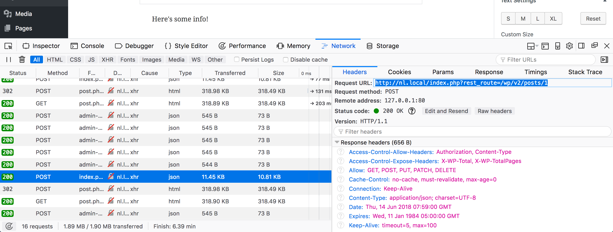
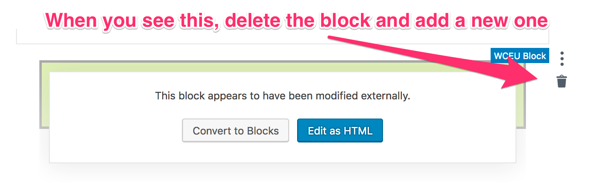

# "Let's Build A Gutenberg Block" at WordCamp EU, 2018!

This Github project will provide the reference files and roadmap for our workshop today. Each portion will be introduced with a short lecture followed by an exercise.

### Learning Goals:

- To explain how a block works
- To read through a block’s code and envision what is happening behind the scenes

### Prerequisites:

Please have the following prepared for the workshop:

* Local install of WordPress with a basic theme active (Twenty Seventeen is great)
* Current version of the Gutenberg plugin installed (v3.0.1)
* Node version 8+, npm version 5.3+
* A text editor such as Sublime, VSCode, or Atom

## Part 0: Introductions (start 10:15)

1. <label><input type="checkbox"/> Introduce yourselves to each other:</label>
    * Name
    * Your experience with WordPress
    * A frustrating moment in development
2. <label><input type="checkbox"/> Decide who will drive first</label>

## Part 1: Orientation (start 10:25)

Lecture: SPA

1. <label><input type="checkbox"/> Create a new post.</label>
2. <label><input type="checkbox"/> Open the Network panel in the console and observe the requests as you work.</label>
2. <label><input type="checkbox"/> Add a few blocks (one of them should be a paragraph block).</label> 
    * <label><input type="checkbox"/> Adjust some settings for the paragraph block in the sidebar.</label>
2. <label><input type="checkbox"/> In the Network panel, select a request for either index.php or post.php and visit the request URL in the browser (highlighted below). What do you see?</label>

5. <label><input type="checkbox"/> Deactivate the Gutenberg plugin.</label>
6. <label><input type="checkbox"/> Reload the WYSIWYG editor and switch to the Text view. Make note of the comments surrounding blocks.</label>
7. <label><input type="checkbox"/> Reload the frontend and make note of any styling differences.</label>
8. <label><input type="checkbox"/> Activate Gutenberg plugin, go back to the editor, and see blocks re-appear!</label>

Debrief:

* What did you see when you visited the request URL?
* What are those HTML comments in the text view of the classic editor?

## Part 2: Scaffold a block with Create Guten Block (start 10:35)

<label><input type="checkbox"/> Switch drivers!</label>

1. <label><input type="checkbox"/> Open the terminal (On Mac: Applications > Utilities > Terminal).</label>
2. <label><input type="checkbox"/> Type `node -v` and press Enter. If you get a response of `v8.0.0` or greater, proceed to step 3. Otherwise, skip to step 9.</label>
3. <label><input type="checkbox"/> Type `npm -v` and press Enter. If you get a response of `v5.3.0` or greater, proceed to step 4. Otherwise, skip to step 9.</label>
4. <label><input type="checkbox"/> `cd` into the plugins directory of your local install (e.g. `cd ~/Sites/wceu-test/wp-content/plugins`)</label>
5. <label><input type="checkbox"/> Run the command `npx create-guten-block wceu-2018` and watch as your block is created!</label> 
6. <label><input type="checkbox"/> Navigate to the plugins screen of your local install and activate your new block</label>
7. <label><input type="checkbox"/> Navigate to a post editor and add the new block</label>
8. <label><input type="checkbox"/> Save and view it from the frontend</label>
9. If your node and npm versions are out of date: Join a different pair programming group with a working machine! Or, if you are comfortable doing so, try updating node/npm via [this blog post](https://solarianprogrammer.com/2016/04/29/how-to-upgrade-nodejs-mac-os-x/). You can also raise your hand for help!

## Part 3: Our block files in `src/block` (start 10:45)

<label><input type="checkbox"/> Switch drivers!</label>

1. <label><input type="checkbox"/> Make sure you have the compiler running in the command line (`npm start`).
2. <label><input type="checkbox"/> Open up blocks/block.js and read through the code comments.</label>
3. Perform these changes to the code:
    1. <label><input type="checkbox"/> Change the title of your block, that is, the one that shows in the block selector</label>
    2. <label><input type="checkbox"/> Change the icon of your block (❤ [Dashicons](https://developer.wordpress.org/resource/dashicons/)!)</label>
    3. <label><input type="checkbox"/> Change the text in the block that displays on the frontend i.e. when you “View Post”</label>
    4. <label><input type="checkbox"/> Change the text in the block that displays on the backend i.e. editor view</label>
    5. <label><input type="checkbox"/> Give the `edit` view a border of `10px solid skyblue`</label>
    6. <label><input type="checkbox"/> Give the frontend view a border radius of 30px</label>
4. To see changes, remember to save and reload the editor!
5. <label><input type="checkbox"/> Bonus: Find how our JavaScript is being enqueued</label>

Debrief:

* What did you learn about how a block is structured?
* What is the difference between the `edit` and `save` view of a block?
* What does the function `registerBlockType` do? (don't think too much about this one...)

Lecture: Anatomy of a block.

## Part 4: Finding Answers in Gutenberg's Source (start 10:55)

<label><input type="checkbox"/> Switch drivers!</label>

1. <label><input type="checkbox"/> View the source of Gutenberg [on Github here](https://github.com/WordPress/gutenberg).</label>
2. <label><input type="checkbox"/> Navigate to the <code>core-blocks</code> directory in Gutenberg's Github repository.</label>
3. <label><input type="checkbox"/> Navigate to `index.js` of a block that you know has editable text, perhaps the Preformatted block, the Heading block, or the Verse block.</label>
4. <label><input type="checkbox"/> Identify where the editable functionality is coming from in the `edit` portion of the block.</label>
5. <label><input type="checkbox"/> Identify where that data is applied to the `save` markup of the block</label>
6. <label><input type="checkbox"/> Review the file from top to bottom. Find another piece of code that is essential for making the block editable.</label>
    * HINT: it's very **import**ant

Debrief:

* What looked familiar?
* What was unexpected?
* What do you have questions about?

## Part 5: Building the Block (remainder of time - 11:05 start)

The exercises are organized as branches in Github. Each branch's code contains an implementation of the feature, and your task is to figure out which changes you need to apply to your own block from the code in the branch. 

**[Start here](https://github.com/laras126/wceu-2018/blob/1-editable/src/block/block.js)** for the first challenge, then change branches using the dropdown on the left below the project menu as you move to each exercise. It looks like this:

Note that I have removed most of the comments on each branch's example code for legibility. You do not have to do this, but you can! Also, remember, that you will see a lot of this:

Refer to [Debugging Techniques](#debugging-techniques) for more information, and raise your hand if you get stuck!

<h4><label><input type="checkbox"/> <code>1-editable</code>: Make the text editable.</label></h4>
Reference `src/block/block.js` on the branch `1-editable`. 

<h4><label><input type="checkbox"/> <code>2-alignment-toolbar</code>: Add options for text alignment.</label></h4>
Again reference `src/block/block.js`, as well as one of the `scss` files.

<h4><label><input type="checkbox"/> <code>3-inner-blocks</code>: Add a nested blocks area.</label></h4>
We have the ability to have nested blocks, or "inner block" areas, in Gutenberg blocks. Perhaps we want to have an area for some free-form content below our editable, say an image or maybe a quote? Rather than writing those blocks ourselves, we can use the `InnerBlocks` component to allow for an area of nested blocks! Switch to the branch `3-inner-blocks` and figure out how to apply that code to your own block.

<h4><label><input type="checkbox"/> <code>4-border-color-control</code>: Create an option for changing the border color.</label></h4>
For general block options, we can use the Inspector Controls component. This is the settings area that shows up in the sidebar, like that of the paragraph block. Switch to branch `4-border-color-control` to apply the functionality to your own block to modify the block's border color.

<h4><label><input type="checkbox"/> <code>5-background-color-control</code>: Create an option for changing the background color.</label></h4>
Let's use the same strategy to create an option for changing the block's background color, and employ the contrast checker component to make sure our colors choices are readable.

<h4><label><input type="checkbox"/> <code>6-editable-improvements-and-heading</code>: Improvements to our editable text, and add a heading.</label></h4>
As I was creating this exercise, I realized the initial `p` element we created would be better as a heading element. Then, we could use this block as a callout style block with a heading. We can also utilize the focus states Gutenebrg provides to make the editing experience more smooth. 

<h4><label><input type="checkbox"/> <code>7-semantic-improvements</code>: Improve block semantics</label></h4>
This is shaping up to be a pretty useful callout or section block! Let's make the markup in our save function a bit more semantic.

<h4><label><input type="checkbox"/> <code>8-style-improvements</code>: Improve block style</label></h4>
Clean up the edit and style CSS (rather, Sass) to have less harsh initial colors, and apply a border to the header. Apply some CSS organizational practices and tweak the display of the edit view.

And now...I think we have a pretty useful block! Whether or not you made it this far in the workshop, this Github project will be online for you to test at any time you like. And, if you go beyond what I've done, feel free to submit a PR and I'll take a look!

## Part 6: Q&A + Conclusion (last 15 mins)

Individually, and in your own words, write 1-3 paragraphs explaining the core components of a block.

## Debugging techniques:

* Make sure the compiler is running and isn't showing syntax errors
* Check the JavaScript console. If it shows an error:
    1. Delete your block
    2. Update the post
    3. Refresh the editor page (command + R)
    4. Create the block again
    5. Read the error
* Make sure you have imported any new components
* Add a `console.log(props.attributes)` to your `edit` function. Does it output what is expected?
* Raise your hand and help will come!

## Helpful links:
* [Learning Gutenberg Series on CSS-Tricks](https://css-tricks.com/guides/learning-gutenberg/) (by me and Andy Bell!)
* [Zac Gordon's Course on Gutenberg](https://gutenberg.courses/)
* [Creating a Global Options Component in Gutenberg](https://webdevstudios.com/2018/04/12/creating-a-global-options-component-in-gutenberg/), WebDevStudios
* [Gutenberg Times](http://gutenbergtimes.com/) for Gutenberg news and other links